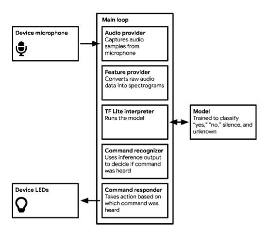
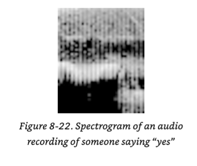
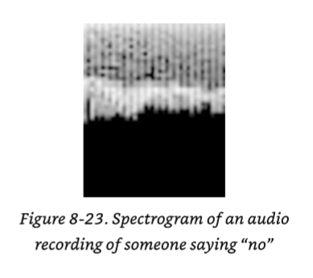

This directory contains the source and documentation covered in the hello_world example we covered in the hands-on workshop.

# Example

We will be using **Machine Learning to predict the values of a sine wave**. This is the classic "hello_world" application for machine learning on microcontrollers of feeding an algorithm data and letting it learn to predict the outputs based on the inputs. In this case the neural network will be trying learn the function of Y = sin(x), by only having the data.

# Hardware

Our examples in this workshop will be using Docker and the command line first and then the [Arduino Nano 33 BLE Sense](https://store-usa.arduino.cc/products/arduino-nano-33-ble-sense).

# Tensorflow Lite

We will be running the examples using TensorFlow Lite for Microcontrollers.

https://www.tensorflow.org/lite/microcontrollers

# Local Development

## Build and Run: Hello_World

We'll be using Docker to intall a Linux image to run the project code locally.

You can install docker by going to:

[https://docs.docker.com/get-docker/](https://docs.docker.com/get-docker/)

after installed you list your current docker images with:
`docker image ls`

1. Setup your environment using Docker
    1. Launch a new docker container using this:
    2. `docker run -it --name ubuntu ubuntu:latest bash`

2. If you have docker and ubuntu already installed you can start the image and open a shell with
    1. `docker start ubuntu`
    2. `docker exec -it ubuntu bash`
    
3. Install the following packages:

```
apt-get update  
apt-get install git  
apt-get install make  
apt-get install wget  
apt-get install unzip  
apt-get install python3  
apt-get install python3-pip  
pip3 install Pillow  
apt-get install curl  
git clone https://github.com/tensorflow/tflite-micro.git  
cd tflite-micro
```

Now that you have all of the tooling setup in a docker container, we can build a hello_world binary from the [source code](https://github.com/tensorflow/tflite-micro.git  ) and then run it. This uses a built in pre-trained model.

compile with:
`make -f tensorflow/lite/micro/tools/make/Makefile hello_world`

run the binary to test:
`./gen/linux_x86_64_default/bin/hello_world`

## Run Tests

By running tests, you'll get much better feel for what the code is doing. Below are the two commands to run to execute the tests for the project.

This uses Make to download the supporting 3rd party libraries:

`make -f tensorflow/lite/micro/tools/make/Makefile third_party_downloads`

This command will run your tests:

`make -f tensorflow/lite/micro/tools/make/Makefile test_hello_world_test`

The path to the source code of the test that is run is here for you to observe.

https://github.com/tensorflow/tflite-micro/blob/main/tensorflow/lite/micro/examples/hello_world/hello_world_test.cc

Success output reads:

```
tensorflow/lite/micro/tools/make/gen/linux_x86_64_default/bin/hello_world_test '~~~ALL TESTS PASSED~~~' linux
Testing LoadModelAndPerformInference
1/1 tests passed
```
## Update Tests

Let's now update the test and ensure that a change to test causes it to fail.

`vi tensorflow/lite/micro/examples/hello_world/hello_world_test.cc`

look at line #110 and change the **y_true** variable to be 1000.f rather than the sin(x) that it's currently set to.

Save the file and then rerun the tests

`make -f tensorflow/lite/micro/tools/make/Makefile test_hello_world_test`

You will receive the output

```
y_true (1.9531245*2^9) near y_pred (1.7791207*2^-1) failed at tensorflow/lite/micro/examples/hello_world/hello_world_test.cc:115
0/1 tests passed
~~~SOME TESTS FAILED~~~
```

Note: 1.7791207*(2^-1) = 1.77 * .5 = .8895 which is approx the sin(1) = .84

and

1.9531245*2^9 = 1.9531245*(2^9) = 1.9 * 512 = 999.999

Which shows that the prediction was expecting to be around .88 and instead was around 1000.

Translating the powers of 2 can be confusing. Suggest just pasting the values into Google. It will figure out the value for you.

## Next Steps

Let's now go through the steps of training the model. The output of this process will be to have an array in C which we can run on any microcontroller to make predictions.

## Train the Model

Let's begin by viewing a [Jupyter notebook](https://jupyter.org/) that will perform the work of training our model.

[https://github.com/justingrammens/machine_learning/blob/master/tensorflow/lite/micro/examples/hello_world/train/train_hello_world_model.ipynb](https://github.com/justingrammens/machine_learning/blob/master/tensorflow/lite/micro/examples/hello_world/train/train_hello_world_model.ipynb)

When viewing the notebook, choose the option of launching a [Google Colab](https://colab.research.google.com/) session. Using Colab allows you to use Google Cloud servers to download the source data and train a neural network on their hardware to make predicitions.

Here's a link to some useful [Google Colab Features](https://colab.research.google.com/notebooks/basic_features_overview.ipynb)

Remember that the purpose of this exercise is to use [TensorFlow Lite](https://www.tensorflow.org/lite) to output a special, space-efficient format for use on memory-constrained devices. TensorFlow Lite is a mobile library for deploying models on mobile, microcontrollers and other edge devices.

Once you follow all of the steps in the Jupyter notebook, return here to run it on hardware.

# Predictions On Hardware!

The final step of this exercise is to run this example on supported hardware. For this exercise we will use the [Arduino Nano 33 BLE Sense](https://store-usa.arduino.cc/products/arduino-nano-33-ble-sense) and the Arduino IDE to compile, build and install the example on our microcontroller.

Let's get started!

## Exercise 1: Hello_World

1. Download and install the [Arduino IDE](https://www.arduino.cc/en/software)
2. Launch the Arduino IDE.
3. Install the TensorFlow Lite library
    1. Select the menu item Tools -> Manage Libraries
    2. Search for "TensorFlow Lite"
    3. Install
4. Open Tensorflow Lite Examples
    1. File -> Examples -> Arduino_TensorFlow Lite -> hello_world
5. Review source code
    1. Specifically look at `model.cpp` - this is the quantized model lives.
    2. Look in `hello_world.ino` since this is the main part of the application where the standard setup() and loop() Arduino functions live.
    3. Look at `arduino_output_handler.cpp` - this where result of Y = sin(x) is mapped to LED brightness. Uncomment out the delay so you can see the values being output easier.
6. Build by selecting "compile"
7. Ensure you have the right hardware libraries installed
    1. Select Tools -> Board -> Board Manager
    2. Search for "Mbed OS Nano"
    3. Install the "Arduino Mbed OS Nano Boards" library.
8. Plug your board into your computer via the USB-C cable
    1. Select Tools -> Port
    2. Ensure that you see the "Arduino Nano 33" option selected.
9. Install
    1. Double press the button the board to put it into bootloader mode.
    2. Ensure the light is pulsing.
    3. You now can now select the arrow to "upload" to the board.
    4. Once it's complete press the button on the board to reset.
10. Output
    1. Review the serial monitor - NOTE the output is going from 0 to 255 as it's mapped to the values between -1 and 1 for the function sin(x)
    2. More interestingly the serial plotter to see the output of predictions. You'll see it follow the sin(x) value

Note: If you have issues loading the firmware, be sure that you double press the button on the BLE Sense 33 to put it into bootloader mode before you try and upload firmware.

## Exercise 2: Micro_Speech



Image from [TinyML](https://www.oreilly.com/library/view/tinyml/9781492052036/)

1. Open the Arduino IDE
2. Select File -> Examples -> Arduino_TensorFlow Lite -> micro_speech
3. Review the source
    1. Specifically `micro_speech.ino` - where the model is loaded
    2. The `arduino_audio_provider.cpp` - where the samples are captured
    3. The `arduino_command_responder.cpp` - responses are handled to the commands inference. See what has been commented out by me in our source code in this project
    3. The `micro_features_model_settings.h` - features are set based on the FFT settings during training
4. Understand how the segmentation and length of samples can dictate the accuracy.
5. Install
    1. Double press the button the board to put it into bootloader mode.
    2. Ensure the light is pulsing.
    3. You now can now select the arrow to "upload" to the board.
    4. Once it's complete press the button on the board to reset.
6. Output
    1. Test inout by saying "yes", "no" and other words.
    1. Review the serial monitor.

### Turn Off Light By Saying No

Next, let's try a quick update to the code to have the light turn off by saying "no".

Change the code so that the response of `found_command` would perform a different action. Hint: Look in arduino_command_responder.cpp. For example, something like:

```
if (found_command[0] == 'o' && found_command[1] == 'n') {
    // turn the light on
```

### Training Model

If you are curious on how the audio is trained for this example, you can load, read and run the Jupyter Notebook from the source code:

[https://github.com/justingrammens/machine_learning/blob/master/tensorflow/lite/micro/examples/micro_speech/train/train_micro_speech_model.ipynb](https://github.com/justingrammens/machine_learning/blob/master/tensorflow/lite/micro/examples/micro_speech/train/train_micro_speech_model.ipynb)

* Note the data that is loaded for the training comes from the [Speech Command Dataset](https://ai.googleblog.com/2017/08/launching-speech-commands-dataset.html)
* It's also cool to see when you run the train.py script all of the various .wav fiels that are loaded into the `/content/dataset` directory in the virtual environment


In this test you can find the data that is mocked out for [YES](https://github.com/tensorflow/tflite-micro/blob/main/tensorflow/lite/micro/examples/micro_speech/micro_features/yes_micro_features_data.cc) and [NO](https://github.com/tensorflow/tflite-micro/blob/main/tensorflow/lite/micro/examples/micro_speech/micro_features/no_micro_features_data.cc)




Images from [TinyML](https://www.oreilly.com/library/view/tinyml/9781492052036/)

When it comes to training, the spectrogram images are much more consistent and contain all the characteristics you need of sound. There's a [really good article on these concepts](https://www.altexsoft.com/blog/audio-analysis/) that I encourage you to read.


### Tests

If you wish to return to your docker instance and be complete, you can run the tests for the audio, which compares the spectrogram created from a .wav audio file with the output of the.

`make -f tensorflow/lite/micro/tools/make/Makefile test_micro_speech_test`

A quick link to the source of the test file for micro_speech is:
 [https://github.com/tensorflow/tflite-micro/blob/main/tensorflow/lite/micro/examples/micro_speech/micro_speech_test.cc](https://github.com/tensorflow/tflite-micro/blob/main/tensorflow/lite/micro/examples/micro_speech/micro_speech_test.cc)

### Other Hardware & MacOS

This example was taken from the main tflite-micro repository. You can read the README.md to see how you might run this on alternative hardware or even MacOS. Details can be found at: [https://github.com/tensorflow/tflite-micro/tree/main/tensorflow/lite/micro/examples/micro_speech](https://github.com/tensorflow/tflite-micro/tree/main/tensorflow/lite/micro/examples/micro_speech)

# Wrapping up

In this tutorial, we have worked through to better understand

* How the concepts of [Machine Learning](https://en.wikipedia.org/wiki/Machine_learning) are different from traditional programming
* Review the source code, examples and tests in the [TensorFlow Lite project for Microcontrollers](https://github.com/tensorflow/tflite-micro)
* Exercised the tests in Linux Docker instance
* Used Google Colab to train our own model to predict outputs based on values following the equation *y=sin(x)*
* After the model was created we loaded the source code and supporting model onto a Arduino Nano 33 BLE Sense microcoroller that showed the ability to run the neural network at the edge


We are just at the start of this new and exciting texchnology. You will continue to hear about [TinyML](httsp://tinyml.org) and [AIoT](https://en.wikipedia.org/wiki/Artificial_intelligence_of_things) in the future and I'm excited to keep sharing what I'm learning and building more examples of how adding AI/ML to IoT is going to change the world around us.
